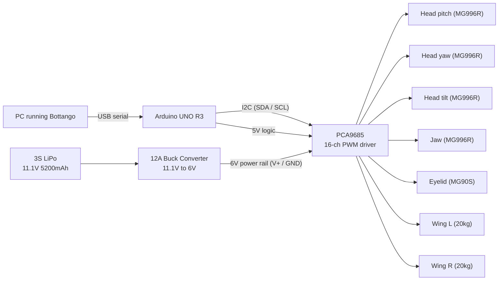

[README.md](https://github.com/user-attachments/files/29279252/README.md)
# Kazooie | Animatronic Cartoon Bird

A self-contained, battery-powered animatronic figure of Kazooie from *Banjo-Kazooie*, designed and built to a theme-park figure aesthetic. Seven servos drive full-axis head articulation, a blinking eyelid, an opening jaw, and expanding wings. The figure is puppeteered live and runs preprogrammed animations through Bottango, with an Arduino managing motion over I2C.


---

## What it does

| Motion | Actuators | Notes |
|--------|-----------|-------|
| Head pitch, yaw, and tilt | 3x MG996R | Full three-axis head movement |
| Jaw open and close | 1x MG996R | Synced to performance |
| Eyelid blink | 1x MG90S | Top-lid-only motion for a cartoon blink |
| Wings expand and retract | 2x 20kg servos | Lever-arm mechanism, highest torque demand |
| Live control + canned animation | Bottango over USB serial | Manual puppeteering plus preprogrammed playback |

The build was scoped as a foundational motion platform. The mechanical and electrical layout leaves headroom to add motion features beyond this first set.

---

## Skills demonstrated

This project covers a full figure pipeline end to end, the same span of work a show or figure technician handles on a real attraction.

- **Mechanical design and CAD.** Head, jaw, eyelid, and wing mechanisms modeled in Fusion 360 and printed to fit.
- **Motion and controls.** Seven-channel servo motion coordinated through a single PWM driver on the I2C bus.
- **Power system design.** A regulated power chain sized so every servo holds a stable 6V under simultaneous load.
- **Embedded programming.** Arduino C++ handling I2C communication and PWM angle commands.
- **Animation and show programming.** Live puppeteering and animation authoring in Bottango.
- **Fabrication and finishing.** 3D printing, assembly, skinning, painting, and feathering to a finished, presentable figure.
- **Systematic troubleshooting.** Power, wiring, and motion issues diagnosed and resolved through the build.

---

## System architecture



Two separate paths keep the logic clean and the motion stable. Commands travel from Bottango to the Arduino over USB serial, then to the PCA9685 over I2C, where they become per-channel PWM angle signals. Power is kept off the logic path entirely: the LiPo feeds a buck converter that holds a steady 6V rail into the PCA9685 power terminals, so torque demand from the wings never browns out the controller.

---

## Bill of materials

| Component | Role | Why it was chosen |
|-----------|------|-------------------|
| Arduino UNO R3 | Microcontroller, the brain of the figure | Parses commands and drives PWM logic to the servo driver |
| PCA9685 | 16-channel PWM servo driver | Gives plug-and-play multi-channel servo control over I2C, well beyond the Arduino's own pin count |
| 12A DC buck converter | Voltage regulator, 11.1V down to 6V | Holds a consistent 6V to every servo regardless of torque demand, keeping motion stable and synchronized |
| 3S LiPo, 5200mAh, 11.1V | Power source | High current output for simultaneous servo movement, with headroom for the buck converter; swappable for portability |
| 2x 20kg servos | Wing actuation | Lever-arm mechanics need higher torque; metal gears, ball bearings, and metal cases handle frequent high-load motion |
| 4x MG996R servos | Head pitch, yaw, tilt, and jaw | Mid-range metal-gear servos with enough torque for lightweight load-bearing joints |
| 1x MG90S servo | Eyelid blink | Compact and light enough to mount inside the head, with low power draw |

---

## Build process

**Concept and schematic.** Motion goals and the full wiring layout were planned before any cutting or printing.


**CAD.** The head, mechanisms, and mounting were modeled in Fusion 360 around the chosen servos.


**Printing and assembly.** Printed parts were assembled into the head and wing frames, then wired into the controller and power system.


**Mechanism and skin.** The articulated head was skinned and the moving structure verified under the cover.


**Aesthetics.** Paint and feathering brought the figure up to its finished character look.


**Finished figure.**


---

## Demo videos

Four motion demos exist for this build. Video files are large, so the recommended path is to upload them to YouTube (unlisted is fine for an application) and link them here:

- Head and jaw motion: `add link`
- Wing expand and retract: `add link`
- Blink and full performance: `add link`

> Tip: an application reviewer is far more likely to click a 30-second hosted clip than download a raw file, so a short, well-lit clip of coordinated motion is worth more than several long ones.

---

## Repository structure

```
kazooie-animatronic/
├── README.md
├── .gitignore
├── docs/
│   └── Final_Project_Report.docx
└── media/
    └── build and finished photos
```

The original slide deck contains the demo videos and is too large to keep in the repository directly. Host it (and the videos) externally and link it in the Demo section above.

---

## About

Built by Corey Hausterman for EET1035C, December 2025. Mechatronics and Robotics Engineering Technology, Seminole State College of Florida.

This is a non-commercial fan and portfolio project. Kazooie and *Banjo-Kazooie* are the property of Nintendo and Rare. No affiliation or endorsement is implied.
